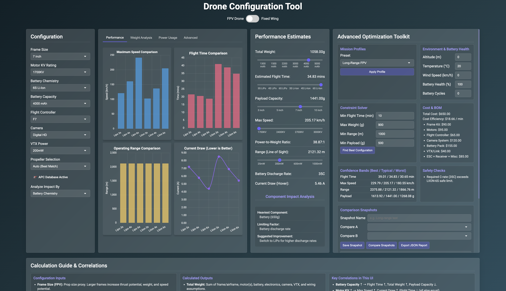

# DroneSetup

[](https://opensource.org/licenses/MIT)
[](https://github.com/enishyseni/dronesetup)
[](https://developer.mozilla.org/en-US/docs/Web/JavaScript)



## Table of Contents

- [Overview](#overview)
- [Layout & Interface](#layout--interface)
- [Core Features](#core-features)
- [Technology Stack](#technology-stack)
- [Installation](#installation)
- [Usage](#usage)
- [Technical Analysis](#technical-analysis)
- [Use Cases](#use-cases)
- [Contributing](#contributing)
- [Roadmap](#roadmap)
- [License](#license)

## Overview

DroneSetup is a browser-based drone configuration and performance analysis tool. It supports both FPV quadcopters and fixed-wing aircraft, letting you select components, visualize performance across four chart tabs, run optimization tools, and read through the built-in calculation guide all in one page without any server or build step.

**Key Benefits:**

- Real-time performance calculations as you change any component
- Physics-based analysis with four interactive chart tabs
- Advanced Optimization Toolkit with mission profiles, constraint solver, cost/BOM, and comparison snapshots
- APC propeller database integration for accurate thrust modeling
- Built-in Calculation Guide & Correlations reference

## Layout & Interface

The UI is organized into three main areas:

**Top row (side by side):**

- **Configuration panel** (left) component selectors for frame, motor KV, battery chemistry/capacity, flight controller, camera, VTX, and propeller; FPV and fixed-wing fields show/hide based on aircraft type
- **Visualization panel** (center) four tabbed chart views: Performance, Weight Analysis, Power Usage, and Advanced
- **Performance Estimates panel** (right) live result readouts with interactive sliders and component impact analysis
- **Advanced Optimization Toolkit** (far right) Mission Profiles, Environment & Battery Health, Constraint Solver, Cost & BOM, Confidence Bands, Safety Checks, Comparison Snapshots, and Sensitivity View

**Bottom:**

- **Calculation Guide & Correlations** documents all inputs, outputs, and the key correlations between them

## Core Features

### Dual Aircraft Support

- **FPV Quadcopters**: 3-inch to 10-inch frame configurations with racing, freestyle, and cinematic setups
- **Fixed-Wing Aircraft**: Conventional, flying wing, and delta configurations from 800mm to 2000mm wingspan
- Toggle switches aircraft type instantly; irrelevant fields hide automatically

### Interactive Visualization Suite

Four tabbed chart groups, each with 22 grid charts powered by Chart.js:

| Tab | Charts |
| ------------------- | -------------------------------------------------------------------------- |
| **Performance** | Max Speed, Flight Time, Range, Efficiency |
| **Weight Analysis** | Weight Distribution, Payload Capacity, Weight Comparison, Component Weight |
| **Power Usage** | Current Draw, Power-to-Weight, Battery Discharge, Thermal Efficiency |
| **Advanced** | Thrust Curve, Efficiency Map, Noise Level, Propeller Efficiency |

### Advanced Optimization Toolkit

- **Mission Profiles** apply presets (Freestyle FPV, Long-Range FPV, Cinematic FPV, Trainer, Cruise Fixed Wing, Efficiency Fixed Wing, Speed Fixed Wing)
- **Environment & Battery Health** adjust altitude, temperature, wind speed, battery health %, and cycle count; results update accordingly
- **Constraint Solver** set minimum flight time, maximum weight, minimum range, and minimum payload; finds the best matching configuration automatically
- **Cost & BOM** live bill of materials with total cost and cost-per-minute efficiency metric
- **Confidence Bands** best / typical / worst scenario ranges for flight time, speed, range, and payload
- **Safety Checks** automatic checklist of potential issues with the current configuration
- **Comparison Snapshots** save named snapshots of any configuration, compare two snapshots side by side, and export a JSON report
- **Sensitivity View** bar chart showing which parameter changes have the greatest impact on performance

### APC Propeller Integration

Real APC propeller database integrated directly into the configuration panel. Select **Auto (Best Match)** for automatic propeller selection based on frame and motor, or switch to **Manual APC Selection** to pick a specific APC propeller by model. Thrust and power calculations use actual APC performance data when available.

### Physics-Based Calculations

- **Motor RPM**: `RPM = KV Voltage`
- **Thrust**: `T = Ct n D`
- **Current draw**: estimated from thrust demand and voltage, split into hover and burst profiles
- **Flight time**: usable battery energy average current consumption
- **Range**: minimum of signal-limited (VTX) and endurance-limited range
- **Wing loading and CG**: fixed-wing specific aerodynamic calculations

### Responsive Design

- Desktop-optimized three-column layout with the toolkit as a fourth sidebar
- Stacks to single-column on screens narrower than 950px
- Dark glassmorphism theme throughout

## Technology Stack

- **HTML5 / CSS3** semantic markup, CSS Grid and Flexbox layout
- **JavaScript (ES6+)** no framework, module-style organization across `calculations.js`, `charts.js`, `componentAnalysis.js`, `main.js`, `apcIntegration.js`, and `apcDemo.js`
- **Chart.js** (CDN) all charts and the sensitivity view
- **chartjs-plugin-datalabels** (CDN) data labels on charts
- **Google Fonts** Roboto typeface

### Browser Support

- Chrome 80+, Firefox 75+, Safari 13+, Edge 80+
- Mobile: iOS Safari 13+, Chrome Mobile 80+

## Installation

No build step required. The app runs entirely in the browser.

1. **Clone the repository**

 ```bash
 git clone https://github.com/enishyseni/dronesetup.git
 cd dronesetup
 ```

2. **Serve locally** (recommended to avoid CORS issues with JS modules)

 ```bash
# Python 3
 python -m http.server 8000

# Node.js
 npx live-server

# PHP
 php -S localhost:8000
 ```

3. **Open** `http://localhost:8000` in your browser, or open `index.html` directly for basic use.

### Troubleshooting

- **Charts not rendering** ensure JavaScript is enabled and the browser supports ES6
- **APC propellers not loading** serve via a local server rather than opening the file directly
- **Layout looks cramped** the UI is designed for 1400px+ wide viewports; zoom out if needed

## Usage

1. **Select aircraft type** using the FPV / Fixed Wing toggle in the header
2. **Choose components** in the Configuration panel (frame, motor KV, battery, camera, VTX, propeller)
3. **Watch charts update** in real time across all four visualization tabs
4. **Read performance estimates** in the right panel; drag the sliders to explore how a single parameter change affects results
5. **Use the Optimization Toolkit** to apply mission presets, set constraints, check costs, compare snapshots, or analyze sensitivity
6. **Refer to the Calculation Guide** at the bottom for a full reference of all inputs, outputs, and correlations

### Configuration Tips

- Higher motor KV increases speed but raises current draw and reduces flight time
- Li-Ion extends endurance on low-load setups; LiPo handles burst demand better
- Use the Constraint Solver when you have hard requirements (e.g. "must fly 15 minutes and carry 200g")
- Save snapshots before making major changes so you can compare before/after

## Technical Analysis

### Component Impact on Flight Parameters

#### Motor & Propulsion

```
Max RPM = KV Battery voltage
Example: 2400KV 16.8V (4S LiPo) = 40,320 RPM

Thrust: T = Ct n D
Ct = thrust coefficient
 = air density (adjusted for altitude and temperature)
 n = rotational speed (rev/s)
D = propeller diameter (m)
```

#### Battery System

```
Current draw: I = (Thrust 3.5) Voltage
Hover: ~4060% of max current
Burst: ~80100% during aggressive maneuvers

Flight time: t = (Capacity_mAh 0.8) (Average_current_A 1000) 60 (minutes)
```

#### Performance Classifications (Thrust-to-Weight)

| Ratio | Category |
| --------- | ----------------------- |
| >2.5:1 | Acrobatic / Racing |
| 2.02.5:1 | Sport / Freestyle |
| 1.52.0:1 | Cinematic |
| 1.21.5:1 | Long-range / Efficiency |

#### Motor Efficiency & Thermal Modeling

```
 = (Mechanical power out Electrical power in) 100%
T = Power_loss Thermal_resistance (C)
```

#### Fixed-Wing Specifics

- **Wing loading**: Total weight wing area
- <30 oz/ft better slow-speed handling
- > 50 oz/ft higher cruise speed, wind penetration
- **CG position**: 2535% MAC (conventional), 1525% MAC (flying wing)

## Use Cases

### FPV Racing

High KV, low battery weight, maximum thrust-to-weight ratio. Check speed and current draw charts to ensure the power system can sustain burst throttle.

### Cinematic / Photography

Balance payload capacity with flight time. Use the Confidence Bands to understand worst-case endurance before going to the field.

### Long-Range / Explorer

Maximize flight time and range using efficient KV selection and Li-Ion chemistry. Set minimum range in the Constraint Solver to find the sweet spot.

### Educational

Use correlations in the Calculation Guide to understand why changing one component has cascading effects across the estimates.

### Pre-Purchase Planning

Enter your target build, check the Cost & BOM panel, compare snapshots of different builds, and export a JSON report.

## Contributing

Contributions are welcome.

1. Fork the repository
2. Create a feature branch: `git checkout -b feature/your-feature`
3. Make changes and test across browsers
4. Open a pull request with a clear description

### Contribution Areas

- Physics improvements to `calculations.js`
- New chart types or toolkit cards
- APC database updates (`APC-Prop-DB.csv`)
- UI/UX refinements
- Bug fixes and browser compatibility

### Bug Reports

Open a GitHub Issue with: description, steps to reproduce, expected vs actual behavior, browser/OS, and a screenshot if applicable.

## Roadmap

### Version 1.2 (Q2 2026)

- [ ] Configuration export and import (JSON)
- [ ] Expanded motor and frame database
- [ ] Multi-language support

### Version 1.3 (Q3 2026)

- [ ] Environment-adjusted charts (altitude/wind affect chart data, not just estimates)
- [ ] Printable/shareable build report
- [ ] Improved mobile layout

### Version 2.0 (2027)

- [ ] 3D aircraft visualization
- [ ] Community build sharing
- [ ] Extended APC database with interpolated performance curves

## License

MIT License Copyright (c) 2026 DroneSetup

Permission is hereby granted, free of charge, to any person obtaining a copy of this software and associated documentation files (the "Software"), to deal in the Software without restriction, including without limitation the rights to use, copy, modify, merge, publish, distribute, sublicense, and/or sell copies of the Software, and to permit persons to whom the Software is furnished to do so, subject to the following conditions:

The above copyright notice and this permission notice shall be included in all copies or substantial portions of the Software.

THE SOFTWARE IS PROVIDED "AS IS", WITHOUT WARRANTY OF ANY KIND, EXPRESS OR IMPLIED, INCLUDING BUT NOT LIMITED TO THE WARRANTIES OF MERCHANTABILITY, FITNESS FOR A PARTICULAR PURPOSE AND NONINFRINGEMENT. IN NO EVENT SHALL THE AUTHORS OR COPYRIGHT HOLDERS BE LIABLE FOR ANY CLAIM, DAMAGES OR OTHER LIABILITY, WHETHER IN AN ACTION OF CONTRACT, TORT OR OTHERWISE, ARISING FROM, OUT OF OR IN CONNECTION WITH THE SOFTWARE OR THE USE OR OTHER DEALINGS IN THE SOFTWARE.

## Acknowledgments

- APC Propellers for their public performance data
- The FPV and RC community for domain knowledge and feedback
- Chart.js contributors
- Everyone who has tested and reported issues

---

**Made with for the drone community**

Questions or suggestions? [Open an issue](https://github.com/enishyseni/dronesetup/issues).
