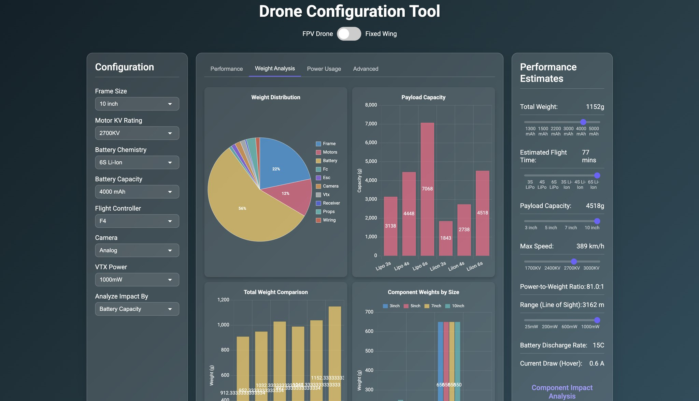

# DroneSetup

A comprehensive tool for configuring and analyzing FPV and fixed-wing drones.



## Overview

DroneSetup helps drone enthusiasts and builders optimize their setups by providing real-time feedback on various performance parameters. It allows you to configure both FPV (First Person View) quadcopters and fixed-wing aircraft, offering detailed insights into flight performance based on component selection.

## Features

- Interactive component selection with real-time performance calculations
- Support for both FPV quadcopters and fixed-wing aircraft
- Comprehensive weight, power, and flight time estimations
- Component analysis to identify limiting factors and suggest improvements
- In-depth technical calculations based on physics and engineering principles
- Comparison tools to understand how component changes affect performance

## Technical Analysis: FPV Drone Components & Performance

### Component Impact on Flight Parameters

#### Propulsion System

- **Motors**: KV rating directly affects RPM per volt. Higher KV = more speed, lower KV = more torque
  - Formula: Max RPM = KV rating × Battery voltage
  - Example: 2400KV motor with 4S (16.8V) battery = 40,320 RPM
- **Propellers**: Size and pitch affect thrust, efficiency, and response time
  - Larger props = more thrust but slower response
  - Higher pitch = more speed but less efficiency
  - Thrust calculation: T = Ct × ρ × n² × D⁴ (where Ct is thrust coefficient, ρ is air density, n is rotational speed, D is prop diameter)

##### Motor and Propeller Matching

- **Motor Size to Frame**: Motor stator dimensions (XXYY format) impact performance:
  - 1806/2204: Suitable for 3" builds (efficiency-focused)
  - 2306/2307: Optimal for 5" freestyle (balanced power/efficiency)
  - 2407/2508: High-power 5" racing and freestyle builds
  - 2810/3007: Heavy-lift capability for 7"+ builds
- **Prop-to-Motor Harmony**:
  - Optimal loading: 2.5-3.5g of thrust per watt of power
  - Efficiency curve calculation: η = (Thrust² ÷ Power) × k (where k is prop constant)
  - Optimal RPM range = 2300 × prop diameter in inches

#### Flight Controller & Software

- **Flight Controller Processing Power**:
  - F4 processor: ~8kHz gyro loop processing
  - F7 processor: ~12kHz gyro loop processing, higher precision math
- **PID Controllers**:
  - P-term (Proportional): Immediate correction response, higher values = faster response
  - I-term (Integral): Error accumulation correction, higher values = less drift
  - D-term (Derivative): Dampens oscillations, higher values = more stability but more noise
- **Filters**:
  - Low-pass filtering reduces noise but adds latency
  - Notch filters target specific frequency ranges
  - Dynamic filters adapt to motor/prop resonance frequencies

##### Advanced Flight Controller Configuration

- **CPU Performance Impact**:
  - F4 vs F7 processors: Loop time reduction from 8kHz to 12kHz
  - Blackbox logging overhead: 2-5% CPU usage at 2K logging rate
- **Filtering Strategies**:
  - Dynamic notch width calculation: BW = base_width × √(loop_time ÷ 8000)
  - Bi-quad filter attenuation = -20log₁₀(Q × f₀/f)dB for f >> f₀
  - Anti-gravity effectiveness = I_term_boost × throttle_change_rate
- **Betaflight/KISS/Emuflight Differences**:
  - Feed-forward implementation: Raw setpoint derivative vs Actual FF calculation
  - Angle/horizon mode mixing ratio = cos(lean_angle × π/180) for smoothed transitions
  - Rate limiting: Effective limit = RC_Rate × Super_Rate × (1-Rate_Expo×stick_position²)

### Advanced Calculations

#### Thrust-to-Weight Mapping

| TWR Value | Flight Characteristic            |
| --------- | -------------------------------- |
| <2:1      | Unable to hover efficiently      |
| 2:1 - 3:1 | Stable hover, minimal acro       |
| 3:1 - 5:1 | Good acro, medium agility        |
| 5:1 - 8:1 | Racing performance, high agility |
| >8:1      | Extremely aggressive maneuvers   |

#### Efficiency Calculations

- **Current Draw Estimation**: I = (Thrust × 3.5) ÷ Voltage
- **Motor Efficiency**: η = (Mechanical power out ÷ Electrical power in) × 100%
- **Optimal prop loading**: 2.5-3.5g/cm² for 5" freestyle builds

### Signal Systems & Radio Frequency Analysis

#### Radio Control Links

- **Protocol Latency Comparison**:
  - ExpressLRS: 2-5ms at 500Hz refresh rate
  - CRSF: 4-6ms at 150Hz refresh rate
  - FrSky D16: 12-15ms at 100Hz refresh rate
- **Link Budget Calculation**:
  - Receiver sensitivity = -90dBm (typical)
  - Free space path loss = 20log₁₀(d) + 20log₁₀(f) - 27.55
  - Maximum range = 10^((TX_power + TX_gain + RX_gain - losses - RX_sensitivity) ÷ 20)

#### Video Transmission

- **Analog vs Digital Comparisons**:
  - Analog: Lower latency (20-40ms), lower clarity, susceptible to interference
  - Digital: Higher latency (30-100ms), higher clarity, better noise rejection
- **Range vs Resolution Trade-off**:
  - Range extension: 1.4× improvement per each 3dB gain in Effective Radiated Power
  - 5.8GHz band attenuation: -0.4dB/100m in clear air

### Applied Configuration Calculator Formulas

Our DroneSetup tools implement these calculations through interactive configurators that provide:

1. **Power System Optimizer**:

   - Motor efficiency mapping based on KV, voltage, prop size
   - Calculates optimal power band: P_opt = (T_hover × 2.5) to (T_hover × 3.5)
   - Thermal modeling: T_rise = P_loss × R_thermal (°C)

2. **Flight Dynamics Predictor**:

   - Rates calculator: Max rotation rate = deg/sec = (RC_Rate × Super_Rate × 200)
   - Flip/roll time estimation: t = (2π × I) ÷ (T_motor × r_arm)
   - Propwash prediction based on frame geometry and PID values

3. **Build Compatibility Matrix**:
   - Component database cross-references for electrical compatibility
   - Mechanical fit verification based on mounting patterns
   - Weight balancing with CG calculations

These tools perform real-time calculations as you select components, providing immediate feedback on how each change affects your drone's theoretical performance before building.

DroneSetup's configuration tools automatically calculate these parameters based on your component selection, helping you build a balanced, efficient FPV drone tailored to your flying style.

## Installation

1. Clone the repository
2. Open index.html in your browser
3. Start configuring your drone!

## Contributing

Contributions are welcome! Please feel free to submit a Pull Request.

## License

This project is licensed under the MIT License - see below for details:

```
MIT License

Copyright (c) 2023 DroneSetup

Permission is hereby granted, free of charge, to any person obtaining a copy
of this software and associated documentation files (the "Software"), to deal
in the Software without restriction, including without limitation the rights
to use, copy, modify, merge, publish, distribute, sublicense, and/or sell
copies of the Software, and to permit persons to whom the Software is
furnished to do so, subject to the following conditions:

The above copyright notice and this permission notice shall be included in all
copies or substantial portions of the Software.

THE SOFTWARE IS PROVIDED "AS IS", WITHOUT WARRANTY OF ANY KIND, EXPRESS OR
IMPLIED, INCLUDING BUT NOT LIMITED TO THE WARRANTIES OF MERCHANTABILITY,
FITNESS FOR A PARTICULAR PURPOSE AND NONINFRINGEMENT. IN NO EVENT SHALL THE
AUTHORS OR COPYRIGHT HOLDERS BE LIABLE FOR ANY CLAIM, DAMAGES OR OTHER
LIABILITY, WHETHER IN AN ACTION OF CONTRACT, TORT OR OTHERWISE, ARISING FROM,
OUT OF OR IN CONNECTION WITH THE SOFTWARE OR THE USE OR OTHER DEALINGS IN THE
SOFTWARE.
```

## Acknowledgments

- Thanks to the drone community for sharing knowledge and expertise
- All contributors who have helped develop and test this tool
